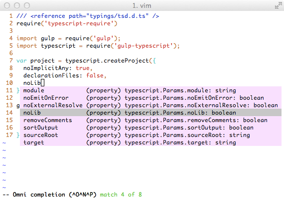

# Tsuquyomi [](https://travis-ci.org/Quramy/tsuquyomi)

Tsuquyomi is a Vim plugin for TypeScript.

## Features

Tsuquyomi works as a client for **TSServer**(which is an editor service bundled into TypeScript).
So, installing Tsuquyomi, your vim gets the following features provided by TSServer:

+ Completion (omni-completion)
+ Navigate to the location where a symbol is defined.
+ Show location(s) where a symbol is referenced.
+ Display a list of syntax and semantics errors to Vim quickfix window.
+ and so on,,,



## How to install
Tsuquyomi requires the following:

+ [Vim](http://www.vim.org/) (v7.4.0 or later)
+ [Shougo/vimproc.vim](https://github.com/Shougo/vimproc.vim)
+ [Node.js](https://nodejs.org/) & [TypeScript](https://github.com/Microsoft/TypeScript) (**v1.5.0 or later**)

### vim v7.4+ and TypeScript

This requires v7.4.0+, which means that you'll need to manually install.

#### OS X

```
brew install vim
```

#### Ubuntu

```
sudo add-apt-repository ppa:fcwu-tw/ppa
sudo apt-get update
sudo apt-get install vim
```

### Pathogen

See https://github.com/tpope/vim-pathogen for instructions to install pathogen itself
(very simple one-line install, one-line config)

```
# create bundle folder if it doesn't exist
mkdir -p ~/.vim/bundle

# Install and compile procvim.vim
git clone https://github.com/Shougo/vimproc.vim.git ~/.vim/bundle/vimproc.vim
pushd ~/.vim/bundle/vimproc.vim
make
popd

# Install tsuquyomi
git clone https://github.com/Quramy/tsuquyomi.git ~/.vim/bundle/tsuquyomi
```

### NeoBundle

If you use [NeoBundle](https://github.com/Shougo/neobundle.vim) for Vim plugin management, append the following to your `.vimrc`:

```vim
NeoBundle 'Shougo/vimproc.vim', {
\ 'build' : {
\     'windows' : 'tools\\update-dll-mingw',
\     'cygwin' : 'make -f make_cygwin.mak',
\     'mac' : 'make -f make_mac.mak',
\     'linux' : 'make',
\     'unix' : 'gmake',
\    },
\ }

NeoBundle 'Quramy/tsuquyomi'
```

And exec `:NeoBundleInstall`.

(About vimproc installation, please see [the original install guide](https://github.com/Shougo/vimproc.vim#install).)

### Install TypeScript

```bash
npm -g install typescript
```

## Usage

### Completion
Tsuquyomi supports Omni-Completion.

By the default, type `<C-x> <C-o>` in insert mode, Tsuquyomi shows completions.

#### Customize completion
You can configure completion with the `completeopt` option.

If you don't want the popup menu:

```vim
autocmd FileType typescript setlocal completeopt-=menu
```

If you want to show a method's signature in the preview window when completion:

```vim
autocmd FileType typescript setlocal completeopt+=menu,preview
```

### Nav to definition
Type `<C-]>` in normal mode or visual mode, Tsuquyomi navigates to the location where the symbol under the cursor is defined.

Alternatively, call the Ex command `:TsuquyomiDefinition` or `:TsuDefinition`.
(All Tsuquyomi's commands have aliases with short prefix `'Tsu'`.)

And type `<C-t>` , Tsuquyomi moves the cursor to the location where the last `<C-]>` was typed.

### Show references
Type `<C-^>` in normal mode or visual mode, Tsuquyomi shows a list of location where the symbol under the cursor is referenced.

Alternatively, call the Ex command `:TsuquyomiReferences`.

### Show quickfix
When a buffer is saved, Tsuquyomi checks syntax and semantics.
And if it contains errors, Tsuquyomi show them to Vim quickfix window.

### Configure compile options
Make [tsconfig.json](https://github.com/Microsoft/TypeScript/wiki/tsconfig.json).

For example:

```json
{
  "compilerOptions": {
    "noImplicitAny": true,
    "target": "es5",
    "module": "commonjs"
  }
}
```

When you change tsconfig.json after opening `*.ts` files, you should exec `:TsuquyomiReloadProject` command.
So, the changes of tsconfig.json are reflected in the TSServer.

### Rename symbols

Using the command `:TsuquyomiRenameSymbol`, you can rename the identifier under the cursor to a new name.

If you want to rename identifiers including in comments, you can use `:TsuquyomiRenameSymbolC` command.
For example, this command is useful when you want rename `opt` in the following code: 

```typescript
/**
*
* @param opt
*
**/
var someFunc = (opt: any) => {...};
```

This feature does not have the default key mapping.
If you need, configure your `.vimrc` . For example: 

```vim
autocmd FileType typescript nmap <buffer> <Leader>e <Plug>(TsuquyomiRenameSymbol)
autocmd FileType typescript nmap <buffer> <Leader>E <Plug>(TsuquyomiRenameSymbolC)
```

### Show balloon(tooltip)
Tsuquyomi can display tooltip window about symbol under the mouse cursor.
If you want to use this feature, configure `.vimrc` as follows:

```vim
set ballooneval
autocmd FileType typescript setlocal balloonexpr=tsuquyomi#balloonexpr()
```

The `ballonexpr` option is not available in terminal Vim. So, Tsuquyomi also provides a tooltip function `tsuquyomi#hint()`.

For example:

```vim
autocmd FileType typescript nmap <buffer> <Leader>t : <C-u>echo tsuquyomi#hint()<CR>
```

The above example works in terminal Vim.


### Show outline(an extension of unite-outline)
This feature requires Vim plugins:

* [unite](https://github.com/Shougo/unite.vim)
* [unite-outline](https://github.com/Shougo/unite-outline).

If you have installed these plugins, calling the following Ex command, the outline of the current buffer is displayed.

```vim
:Unite outline
```

### Use TypeScript installed locally
By the default, Tsuquyomi searches locally installed TypeScript.
If not hit, Tsuquyomi uses TypeScript installed globally.

### More details
If you want more details, please see [doc](doc/tsuquyomi.txt).

## Relevant plugins

* [leafgarland/typescript-vim](https://github.com/leafgarland/typescript-vim) provides syntax highlight.
* [jason0x43/vim-js-indent](https://github.com/jason0x43/vim-js-indent) provides function of indent for both JavaScript and TypeScript.
* [Quramy/vison](https://github.com/Quramy/vison) provides omni-completion tsconfig.json(and more .json files).

## Contribute
### How to test

```sh
npm install
./runtest.sh
```

## License
MIT
