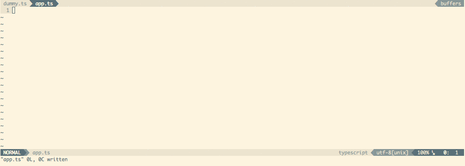

# Tsuquyomi [](https://travis-ci.org/Quramy/tsuquyomi) [](https://greenkeeper.io/)


Make your Vim a TypeScript IDE.


## Features

Tsuquyomi works as a client for **TSServer** (which is an editor service bundled into TypeScript).
So, installing Tsuquyomi, your vim gets the following features provided by TSServer:

+ Completion (omni-completion)
+ Navigate to the location where a symbol is defined.
+ Show location(s) where a symbol is referenced.
+ Display a list of syntax and semantics errors to Vim quickfix window.
+ and so on,,,

### Relevant plugins
Tsuquyomi does not provide syntax-highlight nor indentation. You can use the following Vim plugins for writing .ts:

* [leafgarland/typescript-vim](https://github.com/leafgarland/typescript-vim) provides syntax highlight.
* [Quramy/vim-js-pretty-template](https://github.com/Quramy/vim-js-pretty-template) provides syntax highlight for contents in Template Strings.
* [jason0x43/vim-js-indent](https://github.com/jason0x43/vim-js-indent) provides function of indent for both JavaScript and TypeScript.
* [Quramy/vim-dtsm](https://github.com/Quramy/vim-dtsm) provides `.d.ts` management for [dtsm](https://github.com/vvakame/dtsm) users.
* [mhartington/vim-typings](https://github.com/mhartington/vim-typings) provides `.d.ts` management for [typings](https://github.com/typings/typings) users.

## How to install
Tsuquyomi requires the following:

+ [Vim](http://www.vim.org/) (vim7.4 or later)
+ [Node.js](https://nodejs.org/) & [TypeScript](https://github.com/Microsoft/TypeScript)
+ [Shougo/vimproc.vim](https://github.com/Shougo/vimproc.vim) (Not required if you use vim8 or later)

### Install TypeScript

```bash
npm -g install typescript
```

### Install Tsuquyomi

Download zip.file from [here](https://github.com/Quramy/tsuquyomi/archive/master.zip), or use your favorite Vim plugin manager.

#### Pathogen

See https://github.com/tpope/vim-pathogen for instructions to install pathogen itself
(very simple one-line install, one-line config)

```
# create bundle folder if it doesn't exist
mkdir -p ~/.vim/bundle

# Install and compile procvim.vim
git clone https://github.com/Shougo/vimproc.vim.git ~/.vim/bundle/vimproc.vim
pushd ~/.vim/bundle/vimproc.vim
make
popd

# Install tsuquyomi
git clone https://github.com/Quramy/tsuquyomi.git ~/.vim/bundle/tsuquyomi
```

#### NeoBundle

If you use [NeoBundle](https://github.com/Shougo/neobundle.vim) for Vim plugin management, append the following to your `.vimrc`:

```vim
NeoBundle 'Shougo/vimproc.vim', {
\ 'build' : {
\     'windows' : 'tools\\update-dll-mingw',
\     'cygwin' : 'make -f make_cygwin.mak',
\     'mac' : 'make -f make_mac.mak',
\     'linux' : 'make',
\     'unix' : 'gmake',
\    },
\ }

NeoBundle 'Quramy/tsuquyomi'
```

And exec `:NeoBundleInstall`.

(About vimproc installation, please see [the original install guide](https://github.com/Shougo/vimproc.vim#install).)

## How to use

### Completion
Tsuquyomi supports Omni-Completion.

By the default, type `<C-x> <C-o>` in insert mode, Tsuquyomi shows completions.

#### Customize completion
You can configure completion with the `completeopt` option.

If you don't want the popup menu:

```vim
autocmd FileType typescript setlocal completeopt-=menu
```

If you want to show a method's signature in the popup menu, set `g:tsuquyomi_completion_detail`. **Remarks: This option makes completion slow**

```vim
let g:tsuquyomi_completion_detail = 1
```

If you want to show a method's signature in the preview window when you complete this method's arguments (default):

(The preview window isn't shown when completion properties or variables)

```vim
autocmd FileType typescript setlocal completeopt+=menu,preview
```

### Navigations

#### Definition
Type `<C-]>` in normal mode or visual mode, Tsuquyomi navigates to the location where the symbol under the cursor is defined.

Alternatively, call the Ex command `:TsuquyomiDefinition` or `:TsuDefinition`.
(All Tsuquyomi's commands have aliases with short prefix `'Tsu'`.)

And type `<C-t>` , Tsuquyomi moves the cursor to the location where the last `<C-]>` was typed.

#### Type Definition
`:TsuTypeDefinition` command is similar to `:TsuDefinition`. `:TsuTypeDefinition` navigates to the location where the type of the symbol under the cursor is defined.

#### References
Type `<C-^>` in normal mode or visual mode, Tsuquyomi shows a list of location where the symbol under the cursor is referenced.

Alternatively, call the Ex command `:TsuReferences`. 

If you want where an interface is implemented, use `:TsuImplementation`.

#### Keyword search
Call the Ex command `:TsuSearch {keyword}` to get the list of locations which contain the keyword. This command searches the keyword from opened or referenced files in your project.

The search term minimum length can be configured with `let g:tsuquyomi_search_term_min_length = 3`.

#### Disable default mappings
If you do not want to use the above key mappings please add `let g:tsuquyomi_disable_default_mappings = 1` to your `.vimrc` file.

### Show compile errors
When a buffer is saved, Tsuquyomi checks syntax and semantics. Alternatively call the Ex command `:TsuGeterr`.
And if it contains errors, Tsuquyomi shows them to Vim quickfix window.

If your use TypeScript v1.6.0 or later, you can use `:TsuGeterrProject` command.
This command shows all compilation errors contained in your project to quickfix window.

#### Quick fix
If the cursor is on an error and TypeScript's LanguageService has a code fix for this error, call `:TsuQuickFix`.
The code fix will be applied.

#### Configure compile options
Make [tsconfig.json](http://www.typescriptlang.org/docs/handbook/tsconfig-json.html).

For example:

```json
{
  "compilerOptions": {
    "noImplicitAny": true,
    "target": "es5",
    "module": "commonjs"
  }
}
```

When you change tsconfig.json after opening `*.ts` files, you should exec `:TsuquyomiReloadProject` command.
So, the changes of tsconfig.json are reflected in the TSServer.

#### Integrate with syntastic
If you use [syntastic](https://github.com/scrooloose/syntastic), you can use syntastic for displaying syntax and semantics errors instead of vim's default quickfix window. To integrate syntastic, write the following setting to your .vimrc.

```vim
let g:tsuquyomi_disable_quickfix = 1
let g:syntastic_typescript_checkers = ['tsuquyomi'] " You shouldn't use 'tsc' checker.
```

syntastic has default TypeScript checker whose name is 'tsc'. You shouldn't use it with running Tusuquyomi because they don't share compile options.
Tusuquyomi's checker whose name is 'tsuquyomi' uses tsserver and your tsconfig.json.

### Refactor
#### Rename symbols

Using the command `:TsuRenameSymbol`, you can rename the identifier under the cursor to a new name.

If you want to rename identifiers including in comments, you can use `:TsuRenameSymbolC` command.
For example, this command is useful when you want rename `opt` in the following code: 

```typescript
/**
*
* @param opt
*
**/
var someFunc = (opt: any) => {...};
```

This feature does not have the default key mapping.
If you need, configure your `.vimrc` . For example: 

```vim
autocmd FileType typescript nmap <buffer> <Leader>e <Plug>(TsuquyomiRenameSymbol)
autocmd FileType typescript nmap <buffer> <Leader>E <Plug>(TsuquyomiRenameSymbolC)
```

### Tooltip
Tsuquyomi can display tooltip window about symbol under the mouse cursor. If you want to use this feature, configure `.vimrc` as follows:

```vim
set ballooneval
autocmd FileType typescript setlocal balloonexpr=tsuquyomi#balloonexpr()
```

The `ballonexpr` option is not available in terminal Vim. So, Tsuquyomi also provides a tooltip function `tsuquyomi#hint()`.

For example:

```vim
autocmd FileType typescript nmap <buffer> <Leader>t : <C-u>echo tsuquyomi#hint()<CR>
```

The above example works in terminal Vim.


### Unite sources
Tsuquyomi provides some [unite](https://github.com/Shougo/unite.vim) sources.

#### Show project information(a source of unite)

Execute the following command, your project information is displayed.

```vim
:Unite tsproject
```

The project information contains: 

* tsconfig.json which the current buffer use.
* .ts(or .tsx) source files which TypeScript compiles. These files are determined by tsconfig.json

This feature requires TypeScript@1.6.0 or later.
 
#### Show outline(an extension of unite-outline)
This feature requires Vim plugins:

* [unite-outline](https://github.com/Shougo/unite-outline).

If you have installed these plugins, calling the following Ex command, the outline of the current buffer is displayed.

```vim
:Unite outline
```

### Use TypeScript installed locally
By the default, Tsuquyomi searches locally installed TypeScript. If not hit, Tsuquyomi uses TypeScript installed globally.

And execute the following command, you can confirm the path of tsserver:

```vim
:echo tsuquyomi#config#tsscmd()
```

### Create es6 import declaration
**It's highly experimental**

For example, if your buffer is the following state:

```ts
readFile('hoge', 'utf-8', (err, content) => {
  if(!err) console.log(content);
});
```

Move cursor onto `readFile` and call `:TsuImport`, so Tsuquyomi appends the import declaration.

```ts
import { readFile } from 'fs';
readFile('hoge', 'utf-8', (err, content) => {
  if(!err) console.log(content);
});
```

To allow Tsuquyomi to import the shortest path instead of the complete one (where the initial module declaration is) one, put this in your .vimrc:
```
let g:tsuquyomi_shortest_import_path = 1
```

For example, if your project has the following 2 files, the plugin will use: `import { foo } from './lib';` instead of: `import { foo } from './lib/foo';`.

```ts
/* lib/index.ts */
export * from './foo';
```

```ts
/* lib/foo.ts */
export const foo = 'FOO'
```

### More details
If you want more details, please see [doc](doc/tsuquyomi.txt).

## Contribute
### How to test

Prepare test

```sh
cd test/
yarn install
cd ..
```

Run test cases

```sh
# Run all test cases with all supported TypeScript version
./runtest-all-ts.sh

# Run all test cases with the latest TypeScript version
./runtest.sh

# Run all test cases with the specified TypeScript version
VERSION=2.3 ./runtest.sh

# Run a test file
./run-one-test.sh test/path/to/test.spec.vim

# Run a test file with the specified TypeScript version
VERSION=2.3 ./run-one-test.sh
```

## License
MIT
